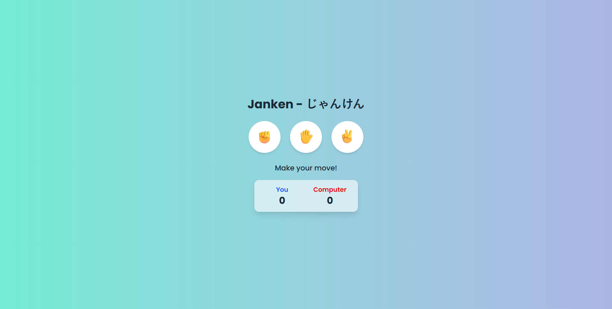

# Janken (じゃんけん) - Rock Paper Scissors Mini Game

**Janken** is a web-based mini game where players compete against the computer. Fully responsive and interactive.


---

## 🚀 Tech Stack

- **HTML5**
- **TailwindCSS**
- **JavaScript (Vanilla)**
- **IBM Granite AI**

---

## ✨ Features

- Player can choose: **Rock, Paper, or Scissors**
- Computer generates a random choice 
- System determines the **winner of each round** in real time
- Displays **player and computer scores**
- Fully responsive design

---

## ⚡ Quick Setup

1. Clone repository:

   ```bash
   git clone https://github.com/username/rock-paper-scissors.git
   ```
   
2. Open the `index.html` in your browser and start playing 🚀

---

## 🤖 AI Assistance

**IBM Granite AI** helped with:
- Generating HTML, CSS, JS boilerplate
- Structuring documentation
- Suggesting performance optimizations

**Benefits**: Faster development, cleaner code, well-structured project.

---

## 📸 Screenshots




